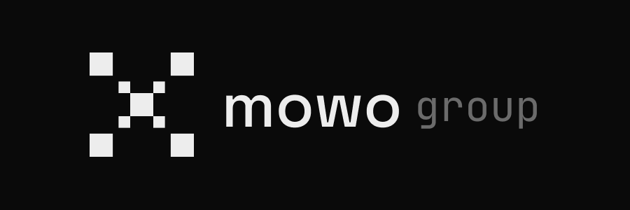

<!--
  Mowo Group — GitHub Organization Profile
  Place this file at: github.com/mowo-group/.github/profile/README.md
-->

<!-- BANNER (replace ./banner.png once it's ready) -->

  

<h1 align="center">Mowo Group</h1>

  <b>Studios, products, and the technology that powers them — all under one roof.</b> 
  Parent company behind <a href="https://mowogames.com">Mowo Games</a> and <a href="https://github.com/mowo-group">MowoEngine</a>. Est. 2026.

  
  
  
  
  

 

## What we build

<table>
  <tr>
    <td width="34%" valign="top">
      <h3>Mowo Games</h3>
      
🟡 In development

      
Our games studio. Where the engine becomes titles, and where the players land.

    </td>
    <td width="33%" valign="top">
      <h3>MowoEngine</h3>
      
🟡 In development

      
Custom C++20 engine for Windows, Linux & macOS. One renderer — Vulkan, with MoltenVK on macOS. Built in-house.

    </td>
    <td width="33%" valign="top">
      <h3>CASTA</h3>
      
🤝 Collaboration · <a href="https://casta.lt">casta.lt</a>

      
Not ours — but we shipped software for it. An esports platform we contributed features to.

    </td>
  </tr>
</table>

 

## Tech we ship with

  
  
  
  
  
  
  
  
  
  
  
  
  

 

## How we work

> **Own the tech.** We build the tools so the ceiling is ours.
> **Ship small, ship often.** Releases beat roadmaps.
> **Operators, not middlemen.** Each venture is run by the people doing the work.
> **Craft over crunch.** Good work needs rested people.

 

## Get in touch

  <a href="https://mowo.group">🌐 mowo.group</a> &nbsp;·&nbsp;
  <a href="https://mowogames.com">🎮 mowogames.com</a> &nbsp;·&nbsp;
  <a href="https://twitter.com/mowogroup">🐦 @mowogroup</a> &nbsp;·&nbsp;
  <a href="https://mowo.group/contact">✉ contact</a>

 

  © 2025–present <b>Mowo Group</b>. Built by people who ship.

